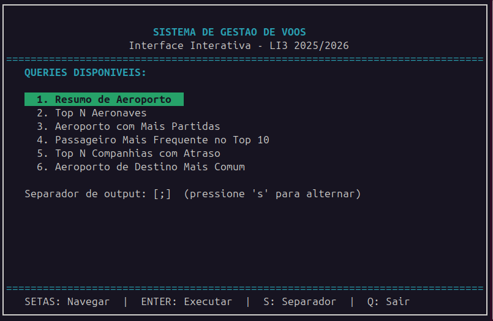
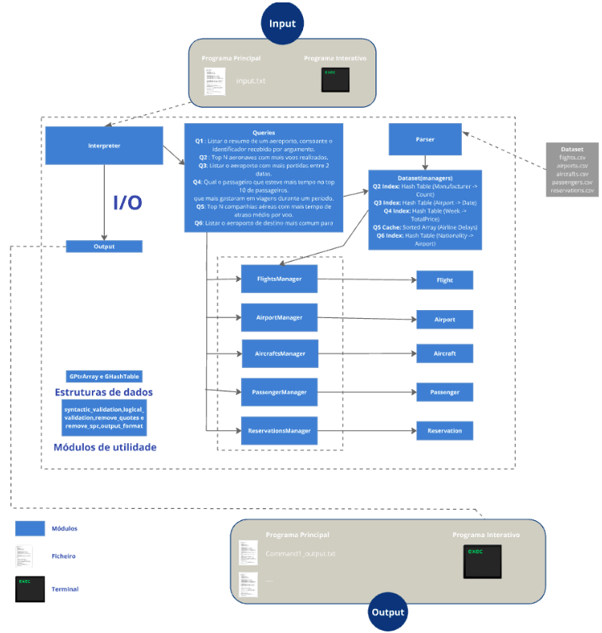

# ✈️ Air Traffic Management System (LI3 2025/2026)

[](https://en.wikipedia.org/wiki/C_(programming_language))
[](https://docs.gtk.org/glib/)
[](https://invisible-island.net/ncurses/)
[]()

## 🖥️ Interface Interativa (ncurses)
> 
>  *A interface suporta navegação por setas e inputs validados em tempo real.*

## 📌 Descrição
 Este sistema foi desenvolvido no âmbito da unidade curricular **Laboratórios de Informática III (LEI - UMinho)**.  O objetivo é processar grandes volumes de dados de tráfego aéreo (Aeroportos, Voos, Passageiros e Reservas) provenientes de ficheiros CSV, submetendo-os a uma validação rigorosa e consultas complexas com tempos de resposta na ordem dos microsegundos.

---

## 🏗️ Arquitetura e Estruturas de Dados
 A estratégia principal do projeto evoluiu de uma correção funcional na Fase 1 para uma **otimização de alta performance** baseada em pré-processamento na Fase 2.

*  **Encapsulamento**: Uso rigoroso de **Ponteiros Opacos (TADs)**, garantindo que a implementação interna está protegida.
*  **Validação de Dados**: Módulos de validação sintática e lógica asseguram a integridade dos dados antes do armazenamento.
*  **Armazenamento Eficiente**: Utilização de `GHashTable` da biblioteca **GLib** para acesso $O(1)$ às entidades principais.
*  **Performance (Pré-computação)**: A complexidade computacional foi antecipada para a fase de *parsing*, permitindo respostas instantâneas.

> 

---

## 🔍 Funcionalidades e Queries
O sistema implementa 6 interrogações principais, otimizadas através de diferentes estratégias:

1.   **Query 1 (Resumo de Aeroporto)**: Otimização via acumulação de contadores durante o parsing.
2.   **Query 2 (Top N Aeronaves)**: Utilização de tabelas de dispersão aninhadas (*Nested Hash Tables*).
3.   **Query 3 (Aeroporto com Mais Partidas)**: Indexação baseada em tabelas hash de datas.
4.   **Query 4 (Passageiro Frequente)**: Agrupamento semanal de gastos e contagem de aparições no Top 10.
5.   **Query 5 (Ranking de Atrasos)**: Conversão para arrays de structs estáticos e ordenados pós-parsing.
6.   **Query 6 (Destinos Comuns)**: Cruzamento de 3 entidades via índices de nacionalidade.

---

## ⚡ Análise de Desempenho
 Os testes demonstraram que a arquitetura adotada é estável e eficiente, com tempos de execução consistentemente baixos em diferentes ambientes:

| Máquina | SO | Memória |
| :--- | :--- | :--- |
| **Computador 1** | Ubuntu 24.04 |  32.0 GiB |
| **Computador 2** | MacOS |  8.0 GiB |
| **Computador 3** | Ubuntu 24.04 |  16.0 GiB |

---

## 🔧 Como Compilar e Executar
### Pré-requisitos
* `libglib2.0-dev`
* `libncurses5-dev`

```bash
# Compilar
make
make programa-interativo

# Modo Interativo
./programa-interativo

# Modo Batch
./programa-principal <dataset_path> <input_file>
